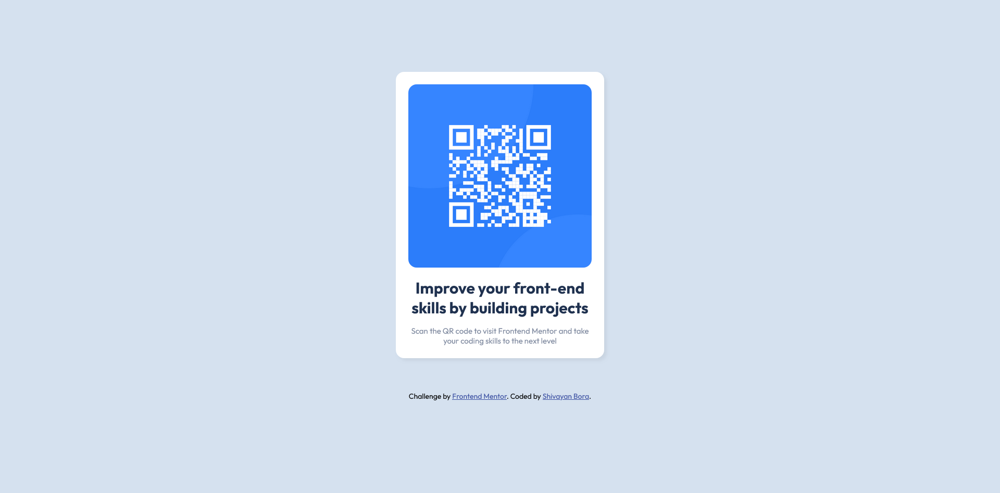

# Frontend Mentor - QR code component solution

This is a solution to the [QR code component challenge on Frontend Mentor](https://www.frontendmentor.io/challenges/qr-code-component-iux_sIO_H). Frontend Mentor challenges help you improve your coding skills by building realistic projects.

## Table of contents

- [Overview](#overview)
  - [Screenshot](#screenshot)
  - [Links](#links)
- [My process](#my-process)
  - [Built with](#built-with)
  - [What I learned](#what-i-learned)
  - [Continued development](#continued-development)
- [Author](#author)

## Overview

### Screenshot

### Links

- Solution URL: [Github](https://your-solution-url.com)
- Live Site URL: [Add live site URL here](https://your-live-site-url.com)

## My process

### Built with

- HTML5
- CSS Flexbox

### What I learned

- Layouts.
- Media Queries.
- Flexbox.
- Using the inspector to help with positioning.
- Using Figma to help with fonts and colors.

### Continued development

I need to learn more about responsiveness using media queries as well as using flexbox and grid. Also, keep things simple and learn more about Semantic HTML.

## Author

- Website - [Shivayan Anand Bora](https://github.com/shivayan-bora)
- Frontend Mentor - [@shivayanbora](https://www.frontendmentor.io/profile/shivayan-bora)
- Twitter - [@shivayanbora](https://twitter.com/shivayanbora)
